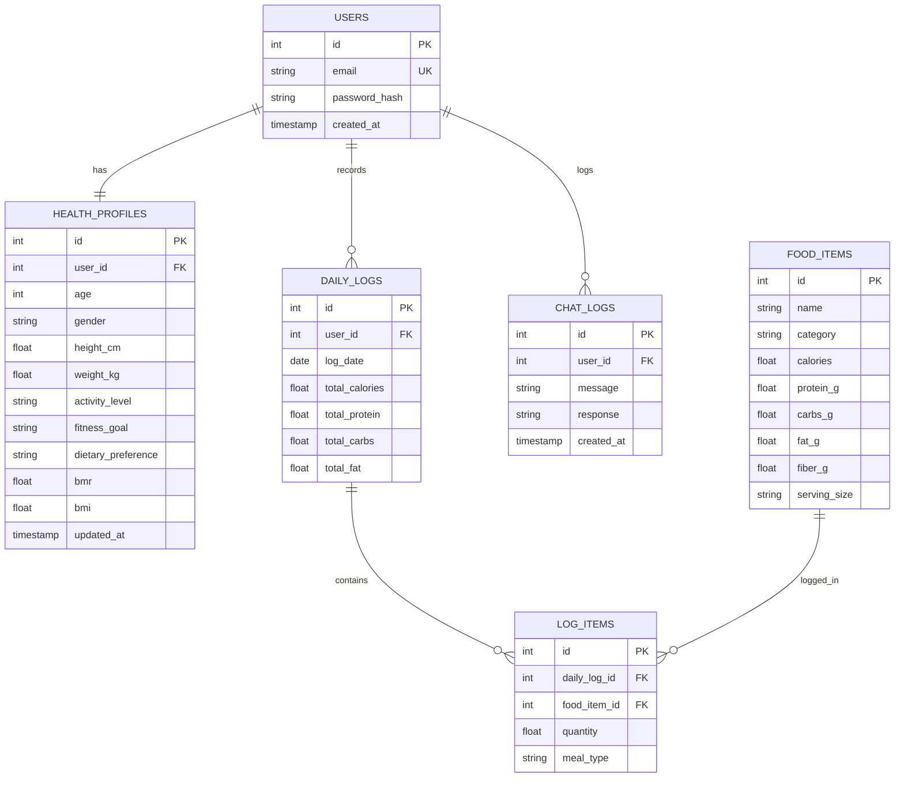

# Database Schema

This document details the relational database design for the system, implemented in **PostgreSQL**.

## Tables Specifications

### 1. `users`
Tracks primary credentials and authentication profiles.

| Column | Type | Constraints | Description |
|---|---|---|---|
| `id` | SERIAL | PRIMARY KEY | Unique user identifier. |
| `email` | VARCHAR(255) | UNIQUE, NOT NULL | User's email address. |
| `password_hash` | VARCHAR(255) | NOT NULL | Hashed password. |
| `created_at` | TIMESTAMP | DEFAULT CURRENT_TIMESTAMP | Registration timestamp. |

### 2. `health_profiles`
Stores physical and preference details used to calculate nutritional targets.

| Column | Type | Constraints | Description |
|---|---|---|---|
| `id` | SERIAL | PRIMARY KEY | Profile ID. |
| `user_id` | INT | FOREIGN KEY, UNIQUE | Reference to `users(id)`. |
| `age` | INT | NOT NULL | User age in years. |
| `gender` | VARCHAR(10) | NOT NULL | "Male", "Female", or "Other". |
| `height_cm` | FLOAT | NOT NULL | Height in centimeters. |
| `weight_kg` | FLOAT | NOT NULL | Weight in kilograms. |
| `activity_level` | VARCHAR(50) | NOT NULL | e.g., Sedentary, Active. |
| `fitness_goal` | VARCHAR(50) | NOT NULL | e.g., Weight Loss, Muscle Gain. |
| `dietary_preference`| VARCHAR(50) | NOT NULL | e.g., Vegan, Vegetarian, Keto. |
| `bmr` | FLOAT | | Calculated Basal Metabolic Rate. |
| `bmi` | FLOAT | | Calculated Body Mass Index. |
| `updated_at` | TIMESTAMP | DEFAULT CURRENT_TIMESTAMP | Last updated timestamp. |

### 3. `food_items`
Contains reference food items extracted from the Kaggle dataset.

| Column | Type | Constraints | Description |
|---|---|---|---|
| `id` | SERIAL | PRIMARY KEY | Food item ID. |
| `name` | VARCHAR(255) | NOT NULL | Name of the food item. |
| `category` | VARCHAR(100) | | Food category/group. |
| `calories` | FLOAT | NOT NULL | Caloric content (kcal) per serving. |
| `protein_g` | FLOAT | NOT NULL | Protein in grams. |
| `carbs_g` | FLOAT | NOT NULL | Carbohydrates in grams. |
| `fat_g` | FLOAT | NOT NULL | Fats in grams. |
| `fiber_g` | FLOAT | | Fiber in grams. |
| `serving_size` | VARCHAR(50) | | e.g., 100g, 1 cup. |

### 4. `daily_logs`
Aggregates daily macro intake for quick historical queries.

| Column | Type | Constraints | Description |
|---|---|---|---|
| `id` | SERIAL | PRIMARY KEY | Daily log record ID. |
| `user_id` | INT | FOREIGN KEY | Reference to `users(id)`. |
| `log_date` | DATE | NOT NULL | Date of the log. |
| `total_calories` | FLOAT | DEFAULT 0 | Cumulative calories tracked today. |
| `total_protein` | FLOAT | DEFAULT 0 | Cumulative protein tracked today. |
| `total_carbs` | FLOAT | DEFAULT 0 | Cumulative carbs tracked today. |
| `total_fat` | FLOAT | DEFAULT 0 | Cumulative fat tracked today. |

### 5. `log_items`
Stores granular entries of specific food items consumed in a meal.

| Column | Type | Constraints | Description |
|---|---|---|---|
| `id` | SERIAL | PRIMARY KEY | Entry ID. |
| `daily_log_id` | INT | FOREIGN KEY | Reference to `daily_logs(id)`. |
| `food_item_id` | INT | FOREIGN KEY | Reference to `food_items(id)`. |
| `quantity` | FLOAT | NOT NULL | Multiplier of the serving size. |
| `meal_type` | VARCHAR(50) | NOT NULL | "Breakfast", "Lunch", "Dinner", "Snack". |

### 6. `chat_logs`
Logs chatbot interactions for analysis and context retention.

| Column | Type | Constraints | Description |
|---|---|---|---|
| `id` | SERIAL | PRIMARY KEY | Chat record ID. |
| `user_id` | INT | FOREIGN KEY | Reference to `users(id)`. |
| `message` | TEXT | NOT NULL | User query. |
| `response` | TEXT | NOT NULL | AI assistant response. |
| `created_at` | TIMESTAMP | DEFAULT CURRENT_TIMESTAMP | Conversation timestamp. |
