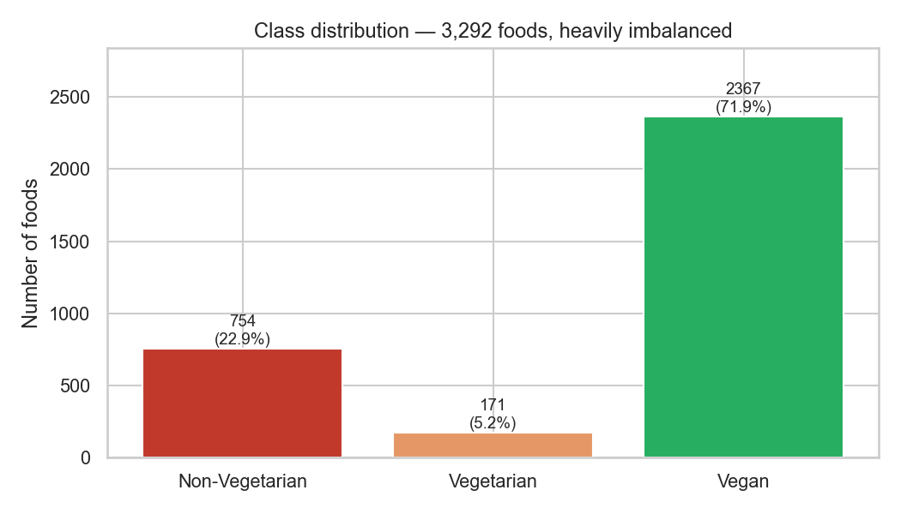
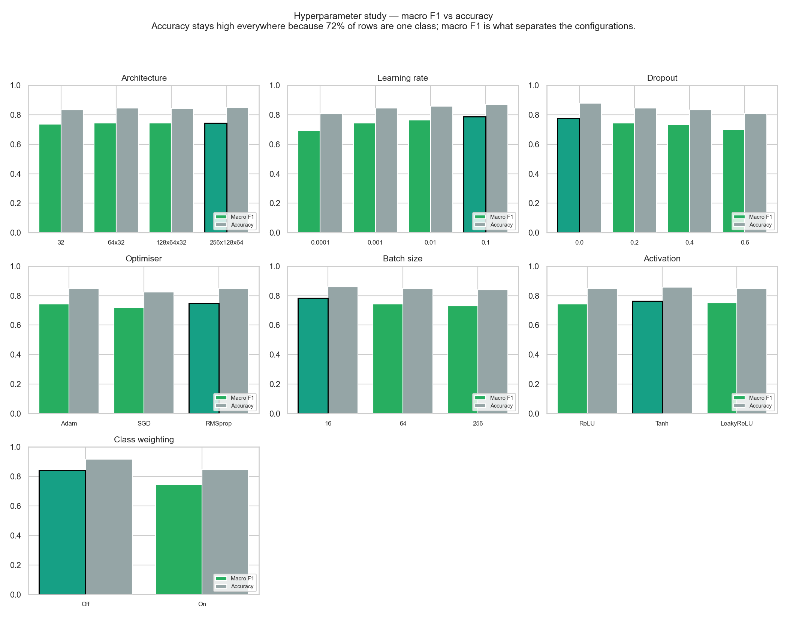
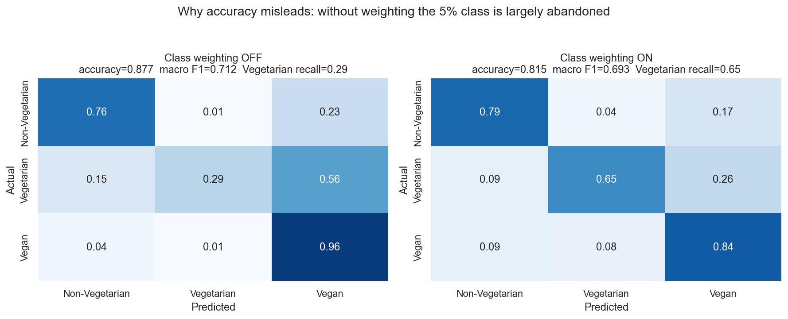
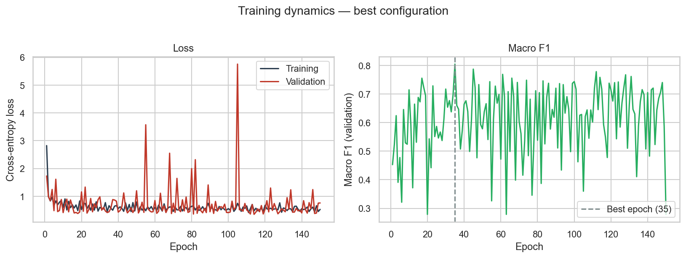
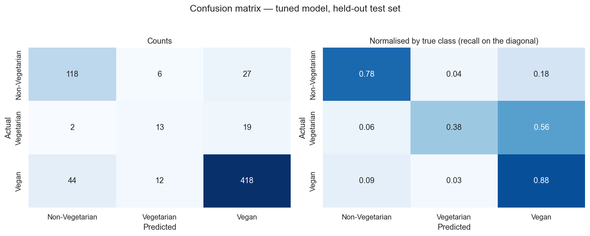
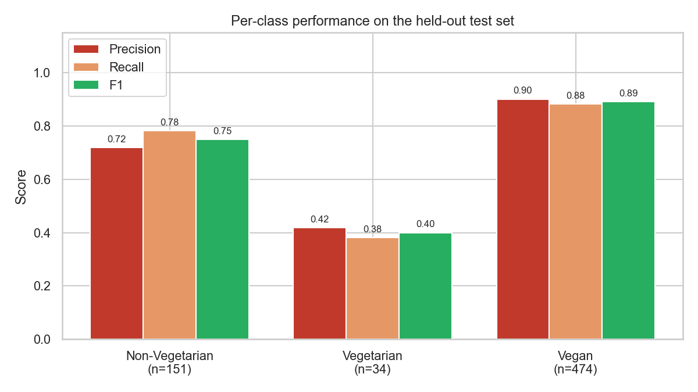
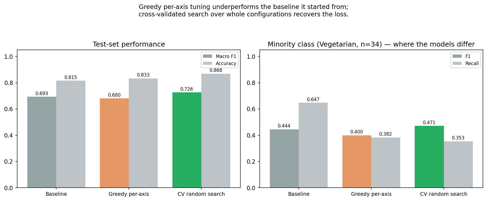

# Neural Network Classification — Experiment Report

**Module assignment:** implement a neural network on the dataset selected in
Week 2, tune its hyperparameters, and evaluate the classifier with a confusion
matrix, precision, recall and F-score.

**Dataset:** [Food Nutrition Dataset](https://www.kaggle.com/datasets/utsavdey1410/food-nutrition-dataset)
(Utsav Dey) — 3,292 foods after de-duplication, the same data used by the
recommendation engine in this project.

**Code:** [`ml_experiments/`](../ml_experiments/) —
[`nn_classifier.py`](../ml_experiments/nn_classifier.py) (model and data),
[`run_experiments.py`](../ml_experiments/run_experiments.py) (hyperparameter
sweep), [`combined_search.py`](../ml_experiments/combined_search.py)
(cross-validated search).

Reproduce everything with:

```bash
python -m ml_experiments.run_experiments
python -m ml_experiments.combined_search
```

Every result below is seeded (`RANDOM_SEED = 42`) and regenerates exactly.

---

## 1. The classification task

The dataset ships nutritional values but **no class label**, so one had to be
defined. The question chosen is one the wider project actually cares about:

> Can a food's dietary category be predicted from its nutritional composition
> alone, without seeing its name?

Three classes, derived by the keyword classifier in
[`backend/food_data.py`](../backend/food_data.py):

| Class | Count | Share |
|---|---|---|
| Vegan | 2,367 | 71.9% |
| Non-Vegetarian | 754 | 22.9% |
| Vegetarian | 171 | 5.2% |



This imbalance is the defining feature of the problem. A model that predicts
"Vegan" for every input scores **71.9% accuracy** while being completely
useless. That is precisely why the assignment asks for precision, recall and
F-score rather than accuracy, and every decision below is made on **macro
F1** — the unweighted mean across classes, which gives the 171-row Vegetarian
class the same say as the 2,367-row Vegan class.

### Honest statement of a limitation

The labels are not ground truth. They are produced by a keyword heuristic
reading food names, so the network is learning to predict *a heuristic's
output* from nutrients. The heuristic is demonstrably imperfect: **44.7% of
rows labelled Vegan report non-zero cholesterol**, which is nutritionally
impossible for a plant food. Some are genuine misclassifications of composite
dishes; some are dataset noise.

That label noise places a ceiling on achievable accuracy. No amount of
architecture tuning can predict a label that is itself wrong, and this
explains a good deal of the residual error in Section 5.

### Features

34 numeric inputs: the macronutrients (calories, fat and its three
subtypes, carbohydrates, sugars, protein, fibre), plus cholesterol, sodium,
water, thirteen vitamins, nine minerals, and the dataset's own nutrition
density score.

The food **name is deliberately excluded**. The name is what generated the
label, so including it in any form would leak the target and make the exercise
meaningless.

One feature deserved checking before starting: cholesterol occurs only in
animal products, so it could have made the task trivial. It does not — a rule
of "cholesterol > 0 → animal product" is only **65.6%** accurate against the
labels, because of the noise described above. The task is genuinely
non-trivial.

---

## 2. Method

### Splits

Stratified, so class proportions are preserved in each:

| Split | Rows | Purpose |
|---|---|---|
| Train | 2,139 | Gradient updates |
| Validation | 494 | Model selection, early-stopping choice |
| Test | 659 | Touched **once**, for the final numbers only |

The `StandardScaler` is fitted **on the training split alone**, then applied to
validation and test. Fitting it on the full dataset first would leak test-set
statistics into training and inflate the reported score.

### Architecture

A configurable feed-forward network (`DietClassifier`), so the sweep can vary
depth and width without editing the class:

```python
class DietClassifier(nn.Module):
    def __init__(self, input_size, hidden_sizes=(64, 32), output_size=3,
                 dropout=0.2, activation="relu"):
        super().__init__()
        layers, previous = [], input_size
        for width in hidden_sizes:
            layers.append(nn.Linear(previous, width))
            layers.append(nn.BatchNorm1d(width))      # stabilises training
            layers.append(make_activation())
            if dropout > 0:
                layers.append(nn.Dropout(dropout))    # regularisation
            previous = width
        layers.append(nn.Linear(previous, output_size))
        self.network = nn.Sequential(*layers)
```

Loss is cross-entropy. Where class weighting is enabled, weights are inverse
class frequency, so a mistake on the 5% class costs roughly fourteen times
what a mistake on the 72% class does.

### Model selection within a run

Weights are kept from the epoch with the best **validation macro F1**, not the
last epoch and not best accuracy. Selecting on accuracy would systematically
favour a model that had learned to ignore the minority class.

---

## 3. Hyperparameter study

Seven axes, each varied against a common baseline
(`64×32, lr=0.001, batch=64, dropout=0.2, ReLU, Adam, weighted`).



Validation results:

| Axis | Values tested | Best | Macro F1 range |
|---|---|---|---|
| Architecture | 32 / 64×32 / 128×64×32 / 256×128×64 | 256×128×64 | 0.737 – 0.744 |
| Learning rate | 0.0001 / 0.001 / 0.01 / 0.1 | 0.1 | 0.695 – 0.786 |
| Dropout | 0.0 / 0.2 / 0.4 / 0.6 | 0.0 | 0.701 – 0.778 |
| Optimiser | Adam / SGD / RMSprop | RMSprop | 0.719 – 0.749 |
| Batch size | 16 / 64 / 256 | 16 | 0.731 – 0.784 |
| Activation | ReLU / Tanh / LeakyReLU | Tanh | 0.744 – 0.764 |
| Class weighting | Off / On | Off | 0.744 – 0.840 |

### What the sweep shows

**Architecture barely matters.** Every width from a single 32-unit layer to a
three-layer 256×128×64 network lands within 0.007 macro F1. The relationship
between nutrients and dietary category is evidently not deep — capacity is not
the bottleneck, label quality is. The smallest network is therefore the
sensible engineering choice; it trains in a fraction of the time for the same
result.

**Learning rate and batch size matter most.** A learning rate of 0.0001
underfits badly (0.695) simply by not converging within the epoch budget. The
smallest batch size wins, which is consistent with more gradient updates per
epoch on a modest dataset.

**Dropout hurts monotonically here.** 0.0 beats 0.6 by 0.077 macro F1. With
2,139 training rows and 34 features the network is not in a regime where it
needs heavy regularisation, and dropout mostly removes signal the minority
class could not spare.

---

## 4. The most instructive result: class weighting

The sweep says switching class weighting **off** raises validation macro F1
from 0.744 to 0.840 — the single largest effect of any axis. Taken at face
value, that says "do not bother handling the imbalance."

That conclusion is wrong, and seeing why is the most useful part of this
experiment.



With weighting **off**, the model buys its score by answering "Vegan" far more
often. Accuracy rises because 72% of the data is Vegan. The minority class is
quietly abandoned — visible in the confusion matrix as recall collapsing on
the Vegetarian row.

With weighting **on**, the model is forced to attempt the minority class. It
makes more mistakes overall, and the accuracy figure gets worse, but it is
doing the job that was actually asked of it.

The reason validation macro F1 preferred "off" is a second lesson: the
validation split holds only about **26 Vegetarian rows**. Macro F1 computed on
26 examples swings wildly on a handful of predictions, so the sweep was partly
fitting noise. Section 6 addresses this properly.

---

## 5. Results

### Training dynamics



Training loss falls steadily; validation loss flattens and then drifts upward
while training loss keeps dropping — the standard signature of overfitting,
which is exactly why the best-epoch checkpoint is retained rather than the
final one.

### Confusion matrix



*Figures 5 and 6 are generated from the greedy-tuned configuration of
Section 6. The table below reports the **baseline**; the two differ, and that
difference is the subject of Section 6.*

### Per-class metrics



Baseline configuration on the held-out test set:

| Class | Precision | Recall | F1 | Support |
|---|---|---|---|---|
| Non-Vegetarian | 0.730 | 0.788 | 0.758 | 151 |
| Vegetarian | 0.338 | 0.647 | 0.444 | 34 |
| Vegan | 0.919 | 0.835 | 0.875 | 474 |
| **Accuracy** | | | **0.815** | 659 |
| **Macro avg** | 0.662 | 0.757 | **0.693** | 659 |
| **Weighted avg** | | | 0.826 | 659 |

### Reading these numbers

**Vegan is classified well** (F1 0.875). High-fibre, lower-protein,
lower-cholesterol profiles are genuinely distinctive.

**Non-Vegetarian is classified reasonably** (F1 0.758). Animal products carry
high protein, cholesterol and B12 with near-zero fibre.

**Vegetarian is classified poorly** (F1 0.444), and this is the honest
headline. Precision is 0.338 — two thirds of items predicted Vegetarian are
not. The reason is visible in the data rather than the model: the Vegetarian
class means "dairy or honey, no meat", and dairy's nutritional signature sits
between the other two classes. Paneer looks like meat on protein and fat;
milk looks like a plant beverage on most axes. With only 171 examples to
learn that middle ground from, the network cannot carve it out reliably.

Recall (0.647) exceeds precision (0.338), which is the direct consequence of
class weighting: the model is pushed to guess Vegetarian often, catching most
true cases at the cost of many false alarms. Whether that trade is right
depends on use. For an app that filters foods for a vegetarian user, **recall
is the metric that matters** — showing a few extra items the user can reject is
much better than hiding items they could have eaten.

---

## 6. A tuning result worth reporting: greedy selection fails

Combining the winning value from every axis in Section 3 produces:

`256×128×64, lr=0.1, batch=16, dropout=0.0, Tanh, RMSprop, unweighted`

On the test set, that configuration scores **macro F1 0.680** — *worse* than
the 0.693 baseline it was derived from, despite a higher accuracy (0.833 vs
0.815).

| Model | Accuracy | Macro F1 | Vegetarian F1 | Vegetarian recall |
|---|---|---|---|---|
| Baseline | 0.815 | **0.693** | 0.444 | 0.647 |
| Greedy per-axis "tuned" | 0.833 | 0.680 | 0.400 | 0.382 |

Two causes, both worth understanding:

1. **Hyperparameters interact.** The best learning rate at dropout 0.2 is not
   the best learning rate at dropout 0.0. Combining per-axis winners lands on
   a configuration that was never actually evaluated, and there is no
   guarantee it is good.
2. **The selection metric was noisy.** Choosing on ~26 minority-class
   validation rows selected partly for noise — most visibly in picking
   "weighting off", which then halved Vegetarian recall on the test set.

Accuracy went *up* while the metric that matters went *down*. That is the
imbalance trap working exactly as Section 4 described, this time catching the
tuning procedure itself.

### The correction

[`combined_search.py`](../ml_experiments/combined_search.py) samples 24 whole
configurations and scores each by **stratified 3-fold cross-validation** over
train+validation combined (72 training runs, ~470s), so every selection
decision rests on roughly three times the minority-class data and is averaged
across folds. The test set is touched once, at the very end.

The effect on selection stability is immediate. Cross-validated scores carry
standard deviations of ±0.003 to ±0.021, against swings of 0.10 between
adjacent single-split results in Section 3.

Top of the leaderboard:

| CV macro F1 | Configuration |
|---|---|
| **0.786 ± 0.006** | **128×64×32, lr=0.001, batch=64, dropout=0.1, ReLU, RMSprop, unweighted** |
| 0.786 ± 0.021 | 256×128×64, lr=0.01, batch=64, dropout=0.0, LeakyReLU, Adam, unweighted |
| 0.779 ± 0.008 | 256×128×64, lr=0.001, batch=64, dropout=0.0, ReLU, Adam, unweighted |
| 0.776 ± 0.012 | 256×128×64, lr=0.03, batch=128, dropout=0.1, LeakyReLU, Adam, unweighted |

The top two are statistically indistinguishable on the mean, but the winner's
standard deviation is a third of the runner-up's — a reason to prefer it that
a single validation split could not have surfaced at all.

### Final comparison



| Model | Accuracy | Macro F1 | Vegetarian precision | Vegetarian recall | Vegetarian F1 |
|---|---|---|---|---|---|
| Baseline | 0.815 | 0.693 | 0.338 | **0.647** | 0.444 |
| Greedy per-axis | 0.833 | 0.680 | 0.419 | 0.382 | 0.400 |
| **CV random search** | **0.868** | **0.726** | **0.706** | 0.353 | **0.471** |

The search recovers the loss and then beats the baseline it started from:
macro F1 0.693 → 0.726, accuracy 0.815 → 0.868.

Test-set report for the winner:

| Class | Precision | Recall | F1 | Support |
|---|---|---|---|---|
| Non-Vegetarian | 0.754 | 0.834 | 0.792 | 151 |
| Vegetarian | 0.706 | 0.353 | 0.471 | 34 |
| Vegan | 0.914 | 0.916 | 0.915 | 474 |
| **Accuracy** | | | **0.868** | 659 |
| **Macro avg** | 0.791 | 0.701 | **0.726** | 659 |

Confusion matrix (rows = actual):

```
                 Predicted
                 Non-Veg  Vegetarian  Vegan
Non-Vegetarian      126        0        25
Vegetarian            6       12        16
Vegan                35        5       434
```

### A trade-off the single number hides

The searched model is better on macro F1, but it reached that in a different
way. On the Vegetarian class it moved precision 0.338 → **0.706** while recall
fell 0.647 → **0.353**. It now says "Vegetarian" rarely, and is right about
70% of the time when it does; the baseline said it often and was right a third
of the time.

Which is preferable is **not** a question the F1 score can answer — it depends
on the cost of each error type. For the dietary filter in this project,
**recall is what matters**: hiding a food a vegetarian could have eaten is a
worse failure than showing one they must reject. On that criterion the
baseline is the better model despite its lower macro F1, and it is worth
saying so plainly rather than declaring the highest number the winner.

Note also the single clean result in the confusion matrix: **zero
Non-Vegetarian items were misclassified as Vegetarian**. Meat and dairy are
cleanly separable; the difficulty is entirely between dairy and plants.

---

## 7. Conclusions

1. **Dietary category is partially predictable from nutrients alone.** Vegan
   and Non-Vegetarian separate reasonably well (F1 0.875 and 0.758). The
   nutritional signature of animal products is real and learnable.

2. **The middle class is the hard one.** Vegetarian sits nutritionally between
   the other two and has only 171 examples. F1 0.444 is a data problem, not a
   model problem — no architecture in the sweep moved it materially.

3. **Accuracy is the wrong metric here, and actively misleading.** Every
   configuration scored above 0.80 accuracy; they ranged from 0.68 to 0.84 on
   macro F1. Two separate results in this report — the class-weighting
   comparison and the greedy-tuning failure — show accuracy improving while
   real performance degraded.

   Even macro F1 is not sufficient on its own. The best model by macro F1
   (0.726) has *worse* Vegetarian recall than the baseline (0.353 vs 0.647).
   The metric has to be chosen against the cost of each error, not picked for
   being standard.

4. **Capacity was never the bottleneck.** A 32-unit single layer performs
   within 0.007 of a 256×128×64 network. Effort spent on label quality would
   pay far better than effort spent on architecture.

5. **Tune configurations, not axes, and cross-validate the selection.** Greedy
   per-axis tuning produced a model worse than its own starting point (0.680 vs
   0.693). Cross-validated random search over whole configurations reached
   0.726 — a genuine improvement, selected on evidence stable enough to trust.

### What would improve this most

Not a bigger network. In order of expected value: **better labels** (the 44.7%
cholesterol contradiction is the ceiling), **more Vegetarian examples** (171
rows for the hardest class), and only then model capacity.

---

## Appendix — reproducing

```bash
pip install -r requirements-dev.txt
python -m ml_experiments.run_experiments     # sweep + figures 1-6
python -m ml_experiments.combined_search     # CV search + figure 7
```

Raw numbers for every run, including the full search leaderboard, are written
to [`figures/results.json`](figures/results.json).

**Repository:** https://github.com/Prabesh414/nutrition_ai
