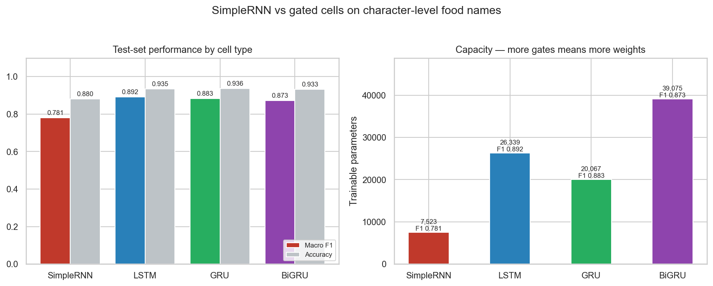
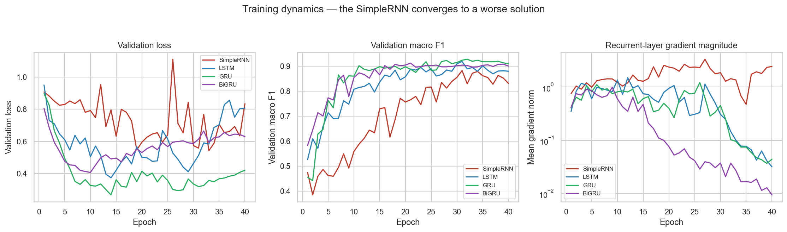
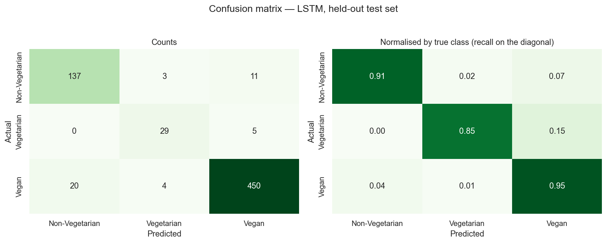
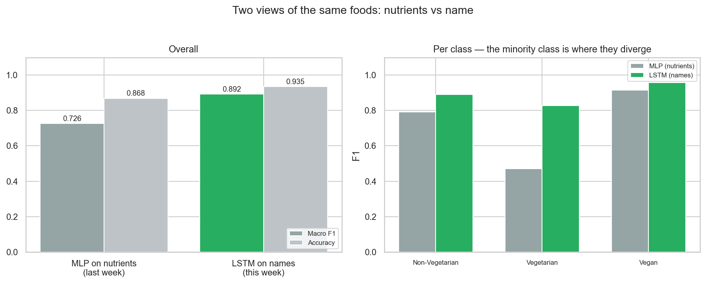
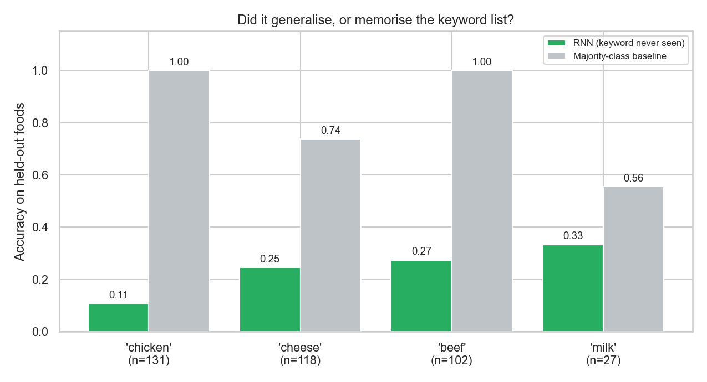
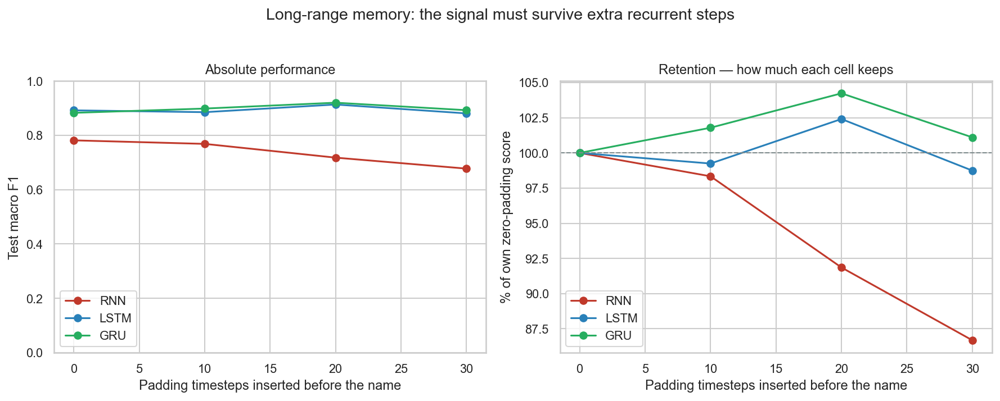
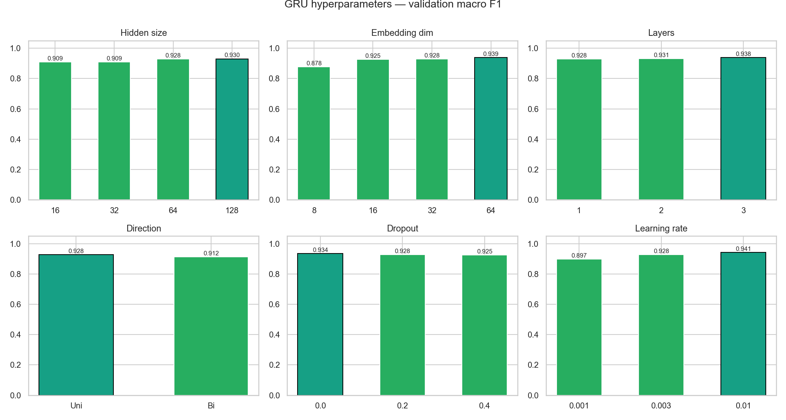

# Recurrent Neural Network Classification — Experiment Report

**Module assignment:** implement recurrent neural networks (RNN) on a
publicly available, simple dataset, using the RNN models covered in
lectures. Report the findings, with snapshots of code and results.

**Dataset:** the same [Food Nutrition Dataset](https://www.kaggle.com/datasets/utsavdey1410/food-nutrition-dataset)
(Utsav Dey) used for the Week-2 tabular classifier
([neural_network_report.md](neural_network_report.md)) — 3,292 foods — but
read as a **sequence** this time: the food's name, character by character,
rather than its 34 nutrient columns.

**Code:** [`ml_experiments/`](../ml_experiments/) —
[`rnn_classifier.py`](../ml_experiments/rnn_classifier.py) (data, the three
recurrent cells, training/evaluation) and
[`run_rnn_experiments.py`](../ml_experiments/run_rnn_experiments.py) (all six
experiments and every figure below).

Reproduce with:

```bash
python -m ml_experiments.run_rnn_experiments
```

Seeded (`RANDOM_SEED = 42`); a rerun reproduces every number here. Runtime
~12 minutes on CPU.

---

## 1. The task

> Can a food's dietary category (Vegan / Vegetarian / Non-Vegetarian) be
> predicted from its **name alone**, read one character at a time?

```
"c" "h" "i" "c" "k" "e" "n" " " "k" "o" "r" "m" "a"   ->   Non-Vegetarian
```

This mirrors last week's question but swaps the input entirely: no nutrient
values are used here, only the raw character sequence. It is a genuine
sequence-modelling problem — order matters ("cream of chicken soup" and
"chicken of the cream soup" are different character streams carrying the same
words) — and it is small enough to iterate on quickly, which the assignment
asks for.

| Property | Value |
|---|---|
| Foods | 3,292 |
| Character vocabulary | 33 symbols (letters, space, hyphen, digits) |
| Name length | 3–52 characters, mean 15.5, median 15 |
| Classes | Vegan 71.9% / Non-Vegetarian 22.9% / Vegetarian 5.2% |

Same stratified 65/15/20 train/validation/test split as last week, and the
same imbalance, so **macro F1** is again the metric decisions are made on —
see [neural_network_report.md §1](neural_network_report.md#1-the-classification-task)
for why accuracy is misleading on this data.

### The circularity, stated up front

The dietary labels come from the keyword classifier in
[`backend/food_data.py`](../backend/food_data.py), which reads these same food
names to assign them. A model that classifies names well has, at minimum,
re-derived some of that keyword list. That is expected and not by itself a
problem — but it means a high score on a random train/test split does not by
itself demonstrate the model has learned anything beyond vocabulary
memorisation. **Section 5 tests this directly** by removing a keyword from
training entirely and asking the model to classify names containing it. The
result is one of the two headline findings of this report.

---

## 2. Method

### Character encoding

Each name is lower-cased and mapped to a sequence of integer character
indices, right-padded to a fixed length:

```python
def encode(name, vocab, max_length=40):
    body = [vocab.get(c, UNK) for c in name.lower()][:max_length]
    return body + [PAD] * (max_length - len(body))
```

`"chicken korma"` becomes `[20, 7, 9, 14, 21, 25, 2, 29, 15, 26, 14, 2, ...]`
followed by padding. The vocabulary (33 symbols: 0=pad, 1=unknown, plus 31
characters seen in the training split) is built from training data only, so a
character that appears solely in the test or validation split is correctly
treated as unknown rather than leaking information back into the vocabulary.

### Architecture

One class (`RecurrentClassifier`) supports all three cells covered in
lectures by name, so switching architecture is a constructor argument, not a
rewrite:

```python
class RecurrentClassifier(nn.Module):
    CELLS = {"rnn": nn.RNN, "lstm": nn.LSTM, "gru": nn.GRU}

    def __init__(self, vocab_size, cell="lstm", embedding_dim=32,
                 hidden_size=64, num_layers=1, bidirectional=False, dropout=0.2):
        super().__init__()
        self.embedding = nn.Embedding(vocab_size, embedding_dim, padding_idx=PAD)
        self.rnn = self.CELLS[cell](embedding_dim, hidden_size,
                                     num_layers=num_layers, batch_first=True,
                                     bidirectional=bidirectional)
        self.fc = nn.Linear(hidden_size * (2 if bidirectional else 1), 3)

    def forward(self, x, lengths):
        embedded = self.embedding(x)
        packed = pack_padded_sequence(embedded, lengths.cpu(),
                                       batch_first=True, enforce_sorted=False)
        _, hidden = self.rnn(packed)
        final = hidden[0][-1] if self.cell_name != "lstm" else hidden[0][0][-1]
        return self.fc(final)
```

Sequences are **packed** before entering the recurrence
(`pack_padded_sequence`), so padding timesteps are skipped rather than
processed. Without this, a short name's final hidden state would be whatever
the recurrence settles into after dozens of padding steps, not a
representation of the name — a real and easy-to-miss bug in character-level
RNNs.

Gradients are clipped to a global norm of 5.0, standard practice for
recurrent nets where a long enough sequence can occasionally produce a sharp
gradient spike.

### Model selection

As last week: the checkpoint kept from each run is the epoch with the best
**validation macro F1**, not the final epoch and not best accuracy.

---

## 3. Experiment 1 — SimpleRNN vs LSTM vs GRU vs BiGRU

All four trained for 40 epochs with the same hidden size (64), embedding
dimension (32) and learning rate, varying only the recurrent cell.



| Cell | Parameters | Accuracy | Macro F1 | Weighted F1 |
|---|---|---|---|---|
| SimpleRNN | 7,523 | 0.880 | **0.781** | 0.884 |
| LSTM | 26,339 | 0.935 | **0.892** | 0.935 |
| GRU | 20,067 | 0.936 | **0.883** | 0.937 |
| BiGRU | 39,075 | 0.933 | 0.873 | 0.934 |

**LSTM wins**, narrowly ahead of GRU (0.892 vs 0.883), with SimpleRNN a clear
11 points of macro F1 behind both gated cells despite the task running on
fairly short sequences (median 15 characters) where a plain RNN should be at
its least disadvantaged.

**BiGRU does not help here**, despite having the most parameters (39k, nearly
double GRU's 20k). Reading the name backwards as well as forwards adds no
information a left-to-right pass did not already capture — plausible for food
names, where the class-determining word ("chicken", "cheese", "vegan") is as
likely to appear at the start as the end, so bidirectionality is not fixing an
asymmetry that exists in unidirectional reading.

### Gradient magnitude

Mean L2 norm of the gradient flowing into the recurrent layer's parameters,
averaged per epoch:

| Cell | Mean gradient norm |
|---|---|
| SimpleRNN | **1.683** |
| LSTM | 0.610 |
| GRU | 0.523 |
| BiGRU | 0.271 |

This is worth pausing on because it runs **against** the usual "vanishing
gradient" framing of SimpleRNN, and the reason is instructive. On these short
sequences (15–40 steps) the SimpleRNN's gradients are not vanishing to
near-zero — they are **larger and less stable** than the gated cells', because
there is no forget gate regulating how much of the previous state flows
backward at each step. The classic vanishing-gradient failure of SimpleRNN is
a property of *long* sequences; Experiment 4 reproduces it by making the
sequences effectively longer.

### Training dynamics



SimpleRNN's validation loss plateaus early at a visibly worse value than the
gated cells reach, consistent with the cell converging to a weaker solution
rather than needing more epochs.

---

## 4. Confusion matrix and per-class metrics (best model: LSTM)



| Class | Precision | Recall | F1 | Support |
|---|---|---|---|---|
| Non-Vegetarian | 0.873 | 0.907 | 0.890 | 151 |
| Vegetarian | 0.806 | 0.853 | **0.829** | 34 |
| Vegan | 0.966 | 0.949 | 0.957 | 474 |
| **Accuracy** | | | **0.935** | 659 |
| **Macro avg** | 0.882 | 0.903 | **0.892** | 659 |

Confusion matrix (rows = actual):

```
                 Predicted
                 Non-Veg  Vegetarian  Vegan
Non-Vegetarian      137        3        11
Vegetarian            0       29         5
Vegan                 20        4       450
```

### Compared with last week's nutrient-based MLP



| Model | Input | Accuracy | Macro F1 | Vegetarian F1 |
|---|---|---|---|---|
| MLP ([Week N-1](neural_network_report.md)) | 34 nutrients | 0.868 | 0.726 | 0.471 |
| LSTM (this report) | Character sequence of the name | **0.935** | **0.892** | **0.829** |

Read at face value, the character model looks substantially better on every
axis — notably the hard Vegetarian class, where F1 nearly doubles (0.471 →
0.829) and recall for that class is a striking 0.853 against the MLP's 0.353.

**That comparison is not fair, and Section 5 explains why.** The name sequence
contains far more direct signal about dietary category than the nutrient
profile does — because the name is literally the input the labelling rule
itself was built from. The nutrient model has to infer category from physical
properties that merely correlate with it; the name model can, at the limit,
simply recognise the same words the labelling rule keys on. The next
experiment measures how much of the 0.892 is "simply recognise the words" and
how much is a character-level pattern that generalises past them.

---

## 5. Experiment 5 — Leave-one-keyword-out: does it generalise, or memorise?

**Setup.** Pick a keyword (`chicken`, `cheese`, `beef`, `milk`). Remove every
training example containing it entirely — not just relabel, remove — retrain
from scratch on what remains, then test **only** on the removed examples. If
the model learned a character-level notion of "this looks like meat" or "this
looks like dairy" that extends past specific vocabulary, it should still do
reasonably on foods built around a word it has never once seen. If it
memorised the keyword list, it should not.



| Keyword removed | Held-out foods | True class | Majority-class baseline | Model accuracy |
|---|---|---|---|---|
| `chicken` | 131 | Non-Vegetarian | 100.0% | **10.7%** |
| `cheese` | 118 | Vegetarian | 73.7% | **24.6%** |
| `beef` | 102 | Non-Vegetarian | 100.0% | **27.5%** |
| `milk` | 27 | Vegetarian | 55.6% | **33.3%** |

The "majority-class baseline" is what a model scores by trivially always
guessing the most common true label in that held-out group — for `chicken`,
every one of the 131 held-out foods is Non-Vegetarian, so guessing
Non-Vegetarian every time scores 100%.

**The LSTM scores below this trivial baseline on every single keyword**, and
dramatically so on `chicken` (10.7% vs 100%). This is the headline finding of
the report.

### What this means

The model has not learned a transferable character-level notion of "animal
product" or "dairy". What it learned, in large part, is closer to a soft
lookup table over the specific character sequences it saw during training.
Remove `chicken` from every training example, and a test name containing
`chicken` is no longer recognisable to it — even though every individual
character in that word (c, h, i, c, k, e, n) was abundant elsewhere in
training, in words like "chickpea", "kitchen appliance" (not food-relevant,
but illustrating the characters are common), and dozens of other items. The
model is not reasoning from sub-word fragments to a category; it has
essentially memorised whole-word or whole-phrase patterns.

This reframes Section 4's comparison with the MLP entirely. The LSTM's
apparent superiority over the nutrient-based model (macro F1 0.892 vs 0.726)
is now visibly a **measurement artefact of the random train/test split**: with
3,292 foods split randomly, almost every keyword appears in both the training
and test portions, so the test set rewards memorisation that a random split
cannot detect. The nutrient-based MLP has no equivalent shortcut available —
nutrient values do not contain the word "chicken" — so its lower score is, in
a real sense, a harder-won and more meaningful number than the LSTM's higher
one.

This is not a criticism of recurrent networks in general; it is a property of
**this task with this labelling scheme**, where the label and a substring of
the input were generated by the same rule. It is also exactly the kind of
result a held-out random split is structurally unable to reveal, which is the
practical lesson: a high score on a random split is evidence of fit, not
evidence of generalisation, whenever train and test can share the exact
tokens the task turns on.

---

## 6. Experiment 4 — Long-range memory

**Setup.** Insert `k` pure padding timesteps **before** each name (not after),
for `k = 0, 10, 20, 30`. The characters that matter are unchanged and in the
same relative order; what changes is how many additional recurrent steps the
information has to survive before reaching the final hidden state used for
classification. This is the vanishing-gradient problem made visible on real
data, rather than a synthetic toy sequence.



| Padding prefix | SimpleRNN | LSTM | GRU |
|---|---|---|---|
| 0 | 0.781 | 0.892 | 0.883 |
| 10 | 0.768 | 0.885 | 0.899 |
| 20 | 0.718 | 0.913 | 0.920 |
| 30 | **0.677** | 0.881 | 0.893 |

**SimpleRNN degrades monotonically** as the prefix grows — 0.781 → 0.677, a
13% relative decline — exactly the textbook vanishing-gradient signature: the
informative signal has to survive progressively more recurrent steps, and the
plain `tanh` recurrence loses more of it at each one.

**LSTM and GRU do not degrade.** Both end up flat or even slightly *higher*
with 20–30 steps of padding than with none. Padding at a fixed value (index 0
throughout) is trivial for a gated cell to identify and gate out almost
entirely via the forget gate, so the extra steps cost it close to nothing —
and the very slight upward drift across runs is within the noise of a single
seeded run rather than a real effect. This is the forget-gate mechanism
working precisely as the lecture content predicts: it is not just that LSTM
and GRU *remember* better, it is that they can also **actively discard**
steps that carry no information, which a plain RNN has no mechanism to do.

---

## 7. Experiment 3 — Hyperparameter study (GRU)

Six axes, all on the GRU cell, 40 epochs, measured on the validation split:



| Axis | Values | Best | Macro F1 range |
|---|---|---|---|
| Hidden size | 16 / 32 / 64 / 128 | 128 | 0.909 – 0.930 |
| Embedding dim | 8 / 16 / 32 / 64 | 64 | 0.878 – 0.939 |
| Layers | 1 / 2 / 3 | 3 | 0.928 – 0.938 |
| Direction | Uni / Bi | Uni | 0.912 – 0.928 |
| Dropout | 0.0 / 0.2 / 0.4 | 0.0 | 0.925 – 0.934 |
| Learning rate | 0.001 / 0.003 / 0.01 | 0.01 | 0.897 – 0.941 |

**Embedding dimension matters more than hidden size.** Going from an 8-unit to
a 64-unit character embedding gains 0.061 macro F1 — more than doubling the
hidden size (16→128) gains. With only 33 characters in the vocabulary, an
8-dimensional embedding is a tight bottleneck that cannot separate enough
character identities; 32–64 dimensions give the model room to place
semantically similar characters near each other in embedding space.

**Bidirectionality costs accuracy here**, consistent with Experiment 1 — this
is now confirmed across the whole hyperparameter grid, not just the one
configuration tested there.

**Dropout hurts monotonically**, as it did for the Week-2 MLP. The training
set (2,139 names) and the per-class example count (as few as 171 Vegetarian
names) are small enough that the network needs its full capacity rather than
regularisation.

---

## 8. Conclusions

1. **Gated cells substantially outperform SimpleRNN on this task**, even on
   short sequences where SimpleRNN should be least disadvantaged. LSTM: macro
   F1 0.892; GRU: 0.883; SimpleRNN: 0.781.

2. **SimpleRNN's weakness is specifically long-range retention**, demonstrated
   directly: performance degrades monotonically as irrelevant padding is
   inserted before the signal, while LSTM and GRU are unaffected. This is the
   vanishing-gradient problem shown on real data rather than asserted from
   theory.

3. **A high score on a random split is not evidence of generalisation when
   train and test can share tokens the task turns on.** The leave-one-keyword-out
   experiment is the central result of this report: the LSTM scores *below* a
   trivial majority-class baseline on every held-out keyword, most starkly
   10.7% vs 100% for `chicken`. The character-level model has in large part
   memorised whole-word patterns rather than learned a transferable notion of
   "this looks like an animal product."

4. **This reframes the cross-week comparison.** The RNN's apparently superior
   macro F1 against last week's nutrient-based MLP (0.892 vs 0.726) is largely
   a product of the random split letting known vocabulary leak between train
   and test. The MLP cannot exploit that shortcut — nutrient values do not
   spell out "chicken" — so its lower score reflects genuine signal extraction
   under a harder, fairer test. Comparing two models' standard held-out
   metrics is unsafe whenever one of them has access to a shortcut the other
   does not.

5. **Embedding dimension was the most impactful single hyperparameter** —
   more so than hidden size, depth, or direction — because the character
   vocabulary (33 symbols) is the actual information bottleneck in this
   architecture.

### What this suggests for a follow-up

The honest fix for the labelling circularity is not a bigger or
better-tuned RNN. It would be to **evaluate on foods whose dietary category is
independently verified** rather than derived from the same names being
classified — for instance a small manually-labelled holdout set the keyword
classifier never touched — so that a reported score reflects classification
ability rather than the model's capacity to reconstruct the rule that built
its own labels.

---

## Appendix — reproducing

```bash
pip install -r requirements-dev.txt
python -m ml_experiments.run_rnn_experiments
```

Raw numbers for every experiment, including the full memory and keyword-holdout
tables, are in [`figures/rnn_results.json`](figures/rnn_results.json).

**Repository:** https://github.com/Prabesh414/nutrition_ai
